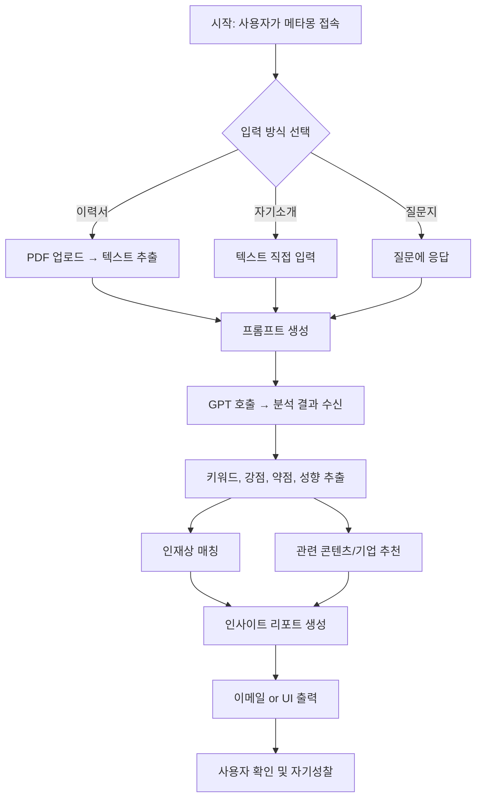

# 메타몽 (Metamong)

**메타몽(Metamong)**은 사용자가 입력한 이력서, 자기소개서, 질문지 응답 등을 기반으로 AI가 **자기 객관화(메타인지)**를 파악하도록 도와주는 **인사이트 리포트 생성 서비스**입니다

 
 

## 서비스 소개

- 자신을 객관적으로 들여다보고, 더 나은 방향을 탐색할 수 있도록 도와주는 서비스

 
 

## 사용자 흐름도

